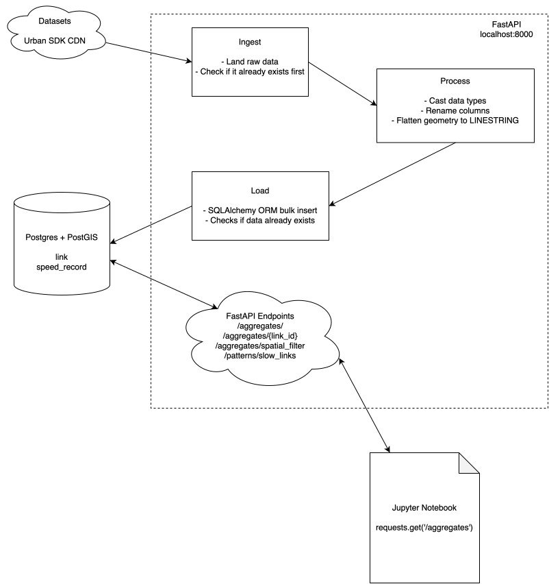

# traffic-data

### Getting Started

To run the API:

`docker compose up`

This will automatically create the database tables via SQLAlchemy ORM. It will then download the datasets and ETL to the database.

To run the notebook, with the API running:

1. Get a free Mapbox access token at [mapbox.com](https://mapbox.com).
2. Create a virtual environment and install Jupyter:
   ```
   python3 -m venv .venv
   source .venv/bin/activate
   pip install jupyter "ipython<9"
   ```
   (`ipython<9` matters here. `mapboxgl`, last released in 2020, breaks under IPython 9.x. We need to pin it *before* the kernel starts
   to avoid needing a kernel restart mid-run.)
3. `export MAPBOX_TOKEN="your_token_here"`
4. `jupyter notebook notebooks/traffic_analysis.ipynb`
5. Run all cells. The notebook installs its remaining dependencies (`pandas`, `geopandas`,
   `mapboxgl`, `shapely`) in the first cell.

### Ingestion

The pdf clearly states that the ingestion should occur in the FastAPI application. I have opted to perform this using the FastAPI native lifespan functionality and added some checks to only perform this if needed. I do this in a blocking call which does take some time but since the web server is more or less useless without the data loaded I think this makes sense. I would not typically couple data ingestion with a web server but my understanding of the pdf is that this is what should be done.

### Processing

The data was already clean so there is not much to do in this step. One thing I found was that ~3,800 of the 1.24M speed records show min = max = average = 0.621 mph. This seemed odd to me until I realized 0.621 mph = 1 km/h and this was likely an artifact of how the data is reported/measured, like the device or vendor applies a floor of 1 km/h or something. I would want to figure out why this is happening and maybe consider filtering out or flagging this data if it's just adding noise to our analysis. Additionally, if this were scaled up I would consider aggregating average speeds or other metrics in this step since I think that might be a bottleneck eventually.

### Load

I created a couple of indexes, chosen based on the queries used in the endpoints. These indexes seemed like a reasonable starting point but of course it could turn out that the query planner doesn't use them, the overhead for writes is too high, etc. I would plan to observe and consider alternatives based on that.

### Architecture


